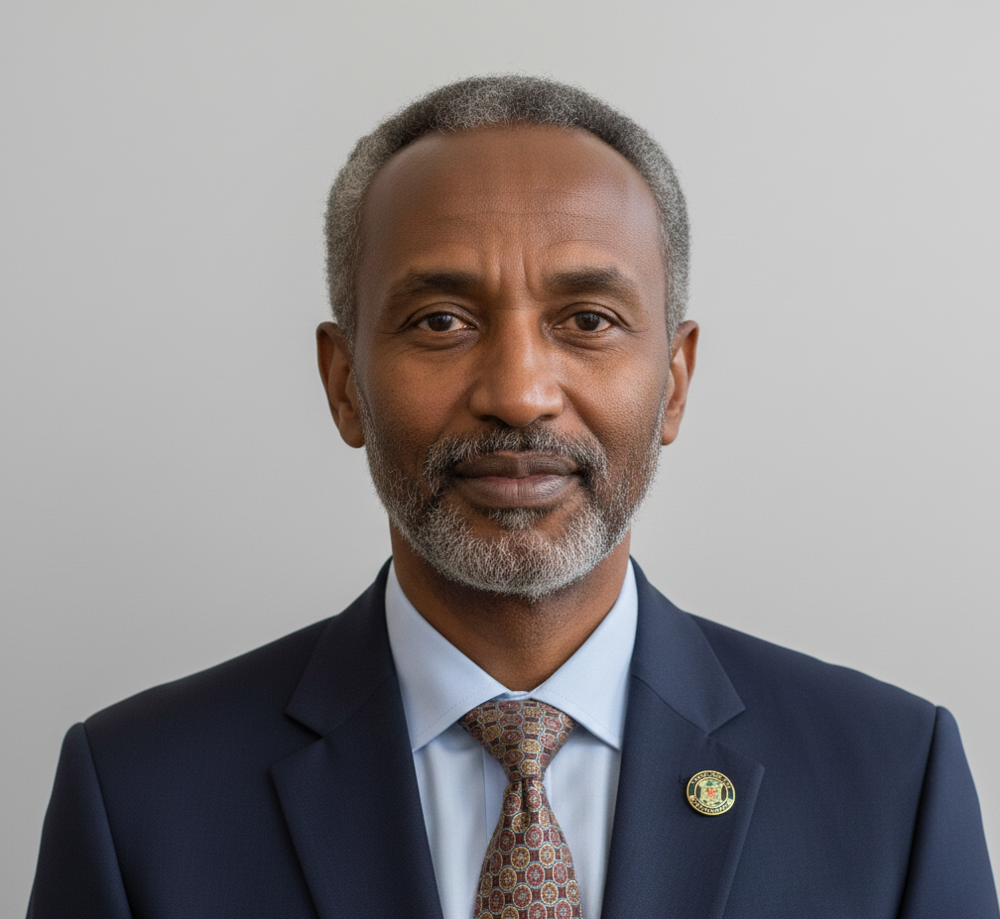

I am a Full Professor in the Department of Computer Science and Engineering at Ethiopian Defence University, where I lead the Data Engineering and Artificial Intelligence Research Group. My academic and professional work focuses on building scalable, intelligent, and data-driven systems that support national development, security, and innovation.

My research and teaching span data engineering, artificial intelligence, and applied machine learning, with a strong emphasis on real-world systems, reliability, and ethical deployment. I have supervised undergraduate and postgraduate research, led multidisciplinary projects, and contributed to both academic and applied research initiatives within the university and beyond.

Our research group is dedicated to designing robust data pipelines and intelligent systems that transform large-scale data into actionable insight. Core research areas include:

- Data Engineering Systems  
  - Large-scale data processing and analytics  
  - Distributed data architectures and cloud-based platforms  
  - Data quality, governance, and security  

- Artificial Intelligence and Machine Learning  
  - Applied machine learning and deep learning  
  - AI-driven decision support systems  
  - Natural language processing and intelligent information retrieval  

- AI for Security and Societal Impact  
  - AI-enabled threat and anomaly detection  
  - Responsible and trustworthy AI deployment  

### Background

- [1995.9 ~ 2000.6] Ethiopian Defence University, Department of Computer Science & Engineering, B.Tech
- [2002.9 ~ 2007.9] Addis Ababa University, School of Computer Science, Ph.D.
- [2015.7 ~ now] Ethiopian Defence University, Department of Computer Science & Engineering, Professor

### Contact

- <em>Email:</em> <b>zak.coe@etdu.edu.et </b> 
- <em>Office:</em> Room 7458, NO.2 Interdisciplinary Building, Ethiopian Defence University, Ethiopia
